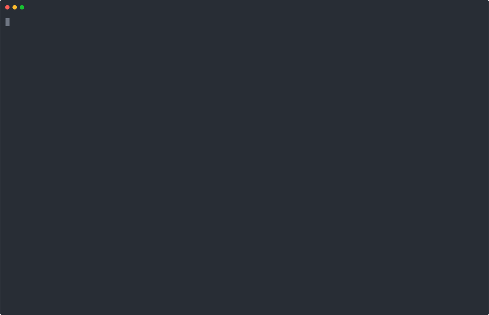

# go-c8y-cli


<p align="center">
    
</p>


Unofficial Cumulocity IoT Command Line Tool

Supported on

* Linux (amd64, x86, armv5->7)
* MacOS (amd64)
* Windows (amd64, x86)

## Installation

See the following installation instructions

* [Shell](https://goc8ycli.netlify.app/docs/installation/shell-installation)
* [Docker](https://goc8ycli.netlify.app/docs/installation/docker-installation)
* [PowerShell](https://goc8ycli.netlify.app/docs/installation/powershell-installation)


## Documentation

See the [documentation website](https://goc8ycli.netlify.app/) for instructions on how to install and use it.

## Contributing

1. Fork the project, then clone it

    ```sh
    git clone https://github.com/reubenmiller/go-c8y-cli.git
    ```

2. Open the project in Microsoft VS Code (using Dev Containers - this requires Docker!)

3. Run initial setup tasks so that you can run c8y inside the dev container

    ```sh
    task init_setup
    
    # reload your shell
    zsh
    ```

3. Add or edit a command specification (`.yaml` file) in `api/spec/yaml/`. The specifications are used to auto generate the go code

4. Run the code generation and build the go binary

    ```sh
    task build
    ```

5. Try out the newly built binary (it should already be added to your)

    **Shell**

    ```bash
    c8y currentuser get
    ```

    **PowerShell**

    ```powershell
    Import-Module ./tools/PSc8y/dist/PSc8y -Force
    Get-CurrentUser
    ```

### Building the documentation

1. Update the auto generated cli docs (if you have changed something)

    ```sh
    task docs
    ```

2. Launch the documentation preview

    ```sh
    task gh_pages
    ```

3. View the documentation in the [browser](http:/localhost:3000)


## Tests

### Pre-requisites

1. Build the latest version and update auto generated tests

    ```sh
    task build
    task generate_cli_tests
    ```

1. Set the c8y session that you want to use for the tests

    ```sh
    set-session
    ```

### Run test on example code

The examples included in the API specification can be validated by running the follow make task.

```sh
task test-cli
```

### Run all tests

```sh
task TEST_THROTTLE_LIMIT=1 test_powershell
```

#### Running a test on a single

```sh
task TEST_FILE_FILTER=ClientRequest test_powershell
```
