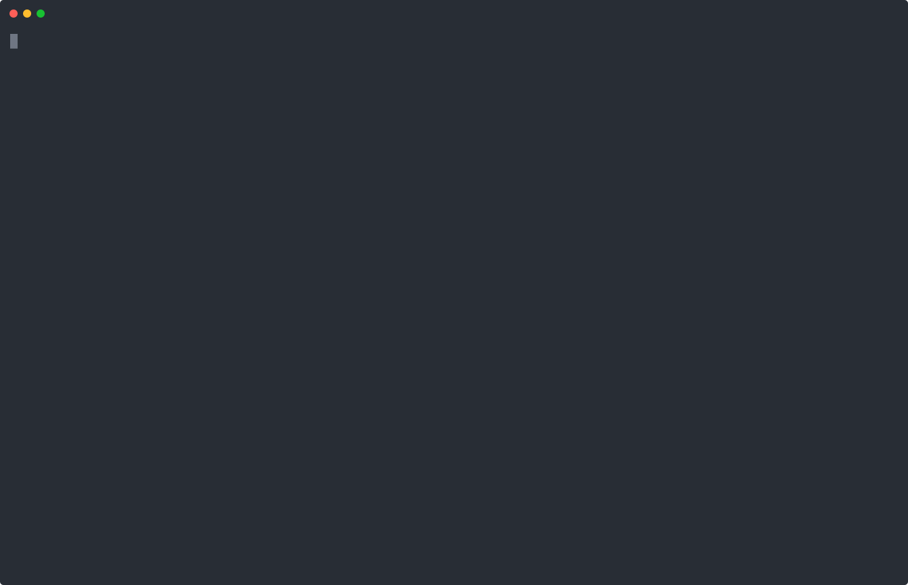

# go-c8y-cli

[](https://github.com/reubenmiller/go-c8y-cli/actions/workflows/main.yml)

<p align="center">
    
</p>


Cumulocity Command Line Tool

Supported on

* Linux (amd64, x86, armv5->7)
* MacOS (amd64, arm64)
* Windows (amd64, x86, arm64 (binary only))

## Installation

See the following installation instructions

* [Shell](https://c8y.app/docs/installation/shell-installation)
* [Docker](https://c8y.app/docs/installation/docker-installation)
* [PowerShell](https://c8y.app/docs/installation/powershell-installation)


## Testing an unreleased version

These instructions are for testing a version that has not yet been officially released, for example directly from a pull request or a specific commit. Go >= 1.25 must be installed on your machine.

### Install

1. Install `c8y` from a specific commit (replace the commit hash with the one you want to test)

    ```sh
    go install github.com/reubenmiller/go-c8y-cli/v2/cmd/c8y@<commit-or-branch>
    ```

    For example, to install from a specific commit:

    ```sh
    go install github.com/reubenmiller/go-c8y-cli/v2/cmd/c8y@7aace7646dfcb7c2a632da85e869daf99c749b90
    ```

2. Make sure the Go binary path is on your `PATH` and takes precedence over any existing `c8y` installation

    ```sh
    export PATH="$(go env GOPATH)/bin:$PATH"
    hash -r
    ```

3. Verify the binary is the expected version

    ```sh
    c8y version
    ```

4. Try it out (note: tab completion won't work when using the `set-session` helper)

    ```sh
    # Option 1: Use an explicit host (no session file required)
    eval "$(c8y sessions login --from-prompt --host example.cumulocity.com)"

    # To enable verbose/debug output, add the -v flag
    c8y currentuser get -v
    ```

### Uninstall

To remove the dev binary and restore the previously installed version:

```sh
rm "$(go env GOPATH)/bin/c8y"
hash -r
```

## Documentation

See the [documentation website](https://c8y.app/) for instructions on how to install and use it.

## Contributing

1. Fork the project, then clone it

    ```sh
    git clone https://github.com/reubenmiller/go-c8y-cli.git
    ```

2. Optional: If you have existing .cumulocity sessions folder, then you can copy the files into the local directory so that they are available for use during development

    ```sh
    cd go-c8y-cli

    # bash/zsh
    mkdir -p .cumulocity
    cp -R ~/.cumulocity/ .cumulocity/
    ```

3. Open the project in Microsoft VS Code (using Dev Containers - this requires Docker!)

    ```sh
    code go-c8y-cli

    # When prompted, build and open the dev container
    ```

4. Run initial setup tasks so that you can run c8y inside the dev container

    ```sh
    task init-setup
    ```

5. Add or edit a command specification (`.yaml` file) in `api/spec/yaml/`. The specifications are used to auto generate the go code

6. Run the code generation and build the go binary

    ```sh
    task generate build-snapshot-single

    # reload your shell
    zsh
    ```

7. Try out the newly built binary (it should already be added to your)

    **Shell**

    ```bash
    c8y currentuser get
    ```

    **PowerShell**

    ```powershell
    task generate build-powershell

    pwsh
    Import-Module ./tools/PSc8y/dist/PSc8y -Force
    Get-CurrentUser
    ```

### Building the documentation

1. Update the auto generated cli docs (if you have changed something)

    ```sh
    task docs
    ```

2. Launch the documentation preview

    ```sh
    task gh-pages
    ```

3. View the documentation in the [browser](http:/localhost:3000)


## Tests

### Pre-requisites

1. Build the latest version and update auto generated tests

    ```sh
    task build
    task generate-cli-tests
    ```

1. Set the c8y session that you want to use for the tests

    ```sh
    set-session
    ```

### Run test on example code

The examples included in the API specification can be validated by running the follow make task.

```sh
task test-cli
```

### Run powershell tests

```sh
task test-powershell
```
